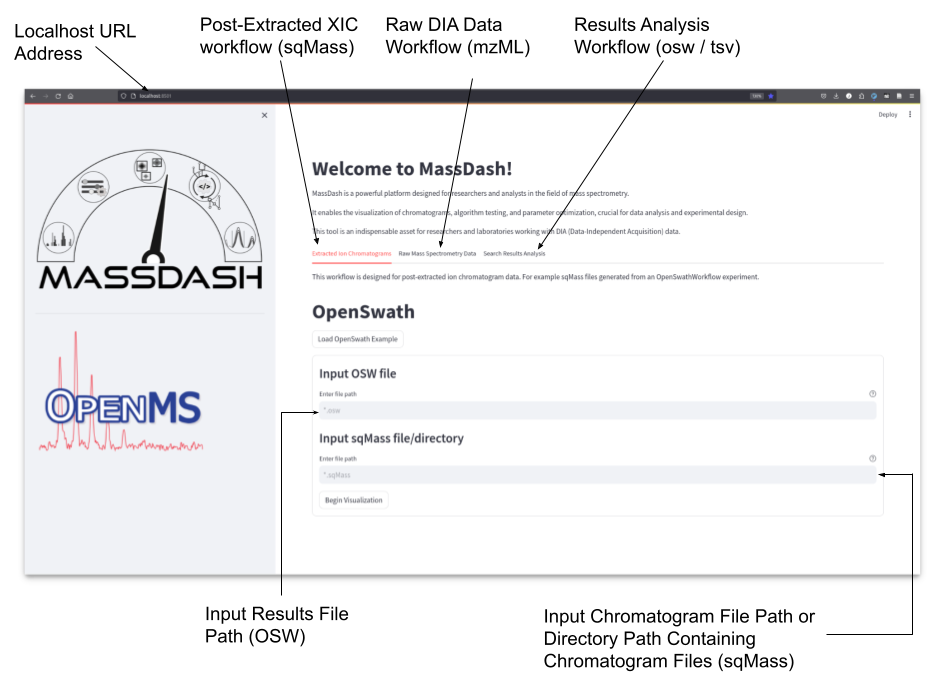

GUI
===

.. toctree::
   :maxdepth: 2
   :hidden:

   gui_docs/Extracted Ion Chromatogram Workflow
   gui_docs/On-The-Fly Targeted Extraction of Raw DIA Mass Spectrometry Data Workflow
   gui_docs/Search Results Comparisons Workflow

MassDash is a modular and flexible python package that has a streamlit graphical user interface (GUI), but can also be used as a python module for regular python scripting. This tutorial will go through the basics of how to use the GUI, for scripting with MassDash, please refer to the API documentation for MassDash.

To run the GUI, enter the following in your terminal:

.. code-block:: bash

   massdash gui

This will redirect you to a browser window under your localhost:port#, the post# by default is usually 8501. If a browser window does not directly open, you can open up a browser window, and enter ``http://localhost:8501/`` in the URL search bar (replace 8501 with a different port number reported in the terminal if 8501 is already in use). 

.. _GettingStartedFig:

   MassDash GUI Welcome Page: i) Localhost URL address hosting GUI, ii) Post-extracted XIC workflow tab, iii) Raw DIA data targeted extraction workflow, Iv) Search results analysis workflow tab, v) Results file input for post-extracted XIC workflow, vi) Input XIC sqMass files for post-extracted XIC workflow.

Once you are redirected to the browser URL hosting MassDash, you will see a welcome page (:numref:`GettingStartedFig`), that contains three tabs:

1. :doc:`Extracted Ion Chromatograms <gui_docs/Extracted Ion Chromatogram Workflow>` - Visualize the resulting extracted ion chromatograms and the peak boundaries identified by an OpenSwathWorkflow analysis.
2. :doc:`Raw Mass Spectrometry Data <gui_docs/On-The-Fly Targeted Extraction of Raw DIA Mass Spectrometry Data Workflow>`  - allows the user to analyze raw DIA mass spectrometry data on-the-fly, extracting features based on a search results experiment (OpenSwath, DIA-NN, DreamDIA, etc.)
3. :doc:`Search Results Analysis <gui_docs/Search Results Comparisons Workflow>` - allows the user to compare the results of different search result experiments (i.e. comparing different software or comparing different extraction parameters)

   
Each workflow has a load example data button that will load test data files, which are available as part of the github repository, or alternatively, you can enter the file paths for the input data, and press the Begin Visualization button to load the data and workflow. Click on an above analysis tab to learn more. 
