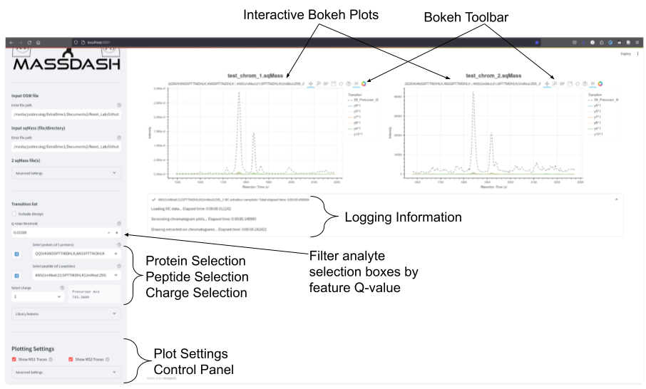
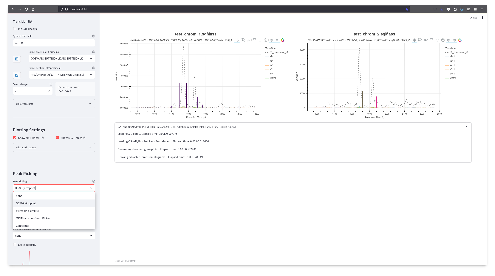
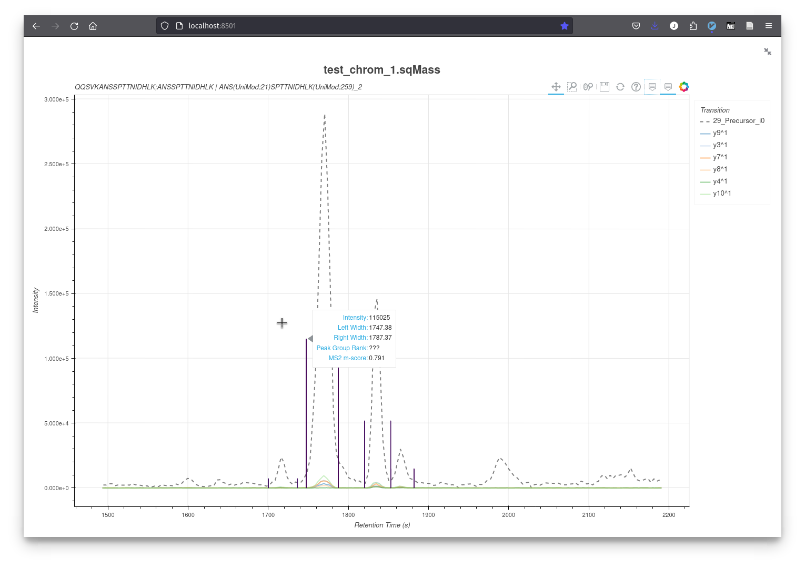

Extracted Ion Chromatograms Workflow
====================================

Upon entering the input files and starting the workflow, you will see the sidebar populated with several elements including: 1.1) input file information, 1.2) transition list information, 1.3) plot control settings, and 1.4) peak picking settings. The main area will be populated with interactive Bokeh figures and a drop-down logging text area that display time-execution information on different processes that were executed for extracting, generating and rendering the extracted ion chromatogram (XIC) figures (:numref:`ExtractedChromatogramExample`).

.. _ExtractedChromatogramExample:

   Extracted Ion Chromatograms Workflow Example. Example showcasing extracted ion chromatograms for two runs. The main area contains interactive Bokeh plots, and the sidebar contains analyte selection settings and plot control settings.

Each figure contains a toolbar that allows for interactive panning, zooming, information hovering, and figure saving. In addition, each plot has an interactive legend that allows for muting of individual traces. The sidebar contains several sections that allow for controlling for analyte selection and control for plotting attributes. The analyte selection (1.2) allows for selecting which analyte to plot, and is split into individual protein, peptide and charge searchable drop down selection boxes. You can either select the analyte via the selection dropdown or you can use the random selection buttons that will randomly select an analyte to plot. By default, the analytes populated in the drop down selection boxes are filtered based on the feature Q-value of 1%, this can be adjusted if you want to include less confident or more confident identifications.

.. _PeakPickingDropdown:

   Peak-Picking Dropdown List Options. The peak-picking dropdown selection allows the user to select different peak-picking algorithms to display peak boundaries on the chromatogram figure.

The figures can be further controlled, by adjusting settings in the Plotting Settings section, that allows for displaying or hiding MS1 or MS2 traces. The advanced dropdown panel allows for controlling how the plots are arranged in a grid and allows for smoothing of the traces. Aside from just visualizing the XICs, it is also possible to visualize the peak boundaries identified by OpenSwath. This can be turned on in the Peak-Picking dropdown selection box, which allows for the selection of either the identified peaks by OpenSwath or on-the-fly peak picking with several different peak-picking algorithms (:numref:`PeakPickingDropdown`). Once selected, the peak boundaries will be rendered onto the figure. Each peak boundary contains meta-information that can be hovered over to show information about the identification, such as the peak boundaries, the retention time apex, the retention time apex intensity, and the peak group features Q-Value (:numref:`PeakBoundaryInformation`).

.. _PeakBoundaryInformation:

   Peak Boundary Information. Hovering over the peak boundaries displays text information about the identified peak.
