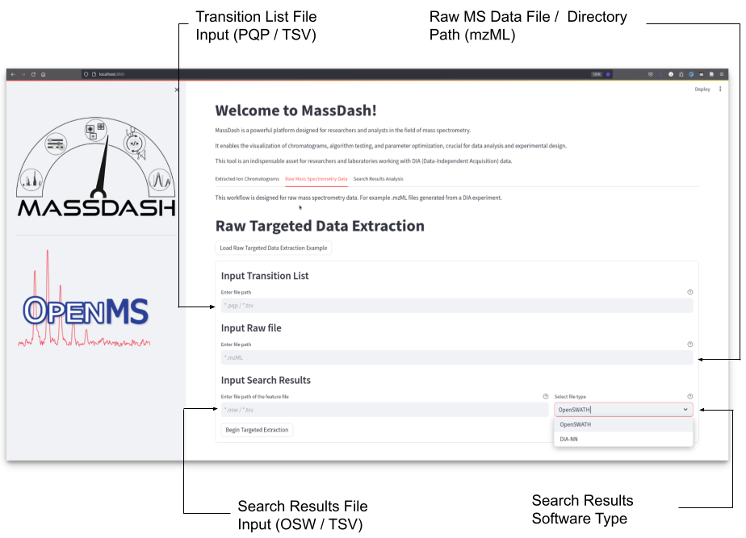
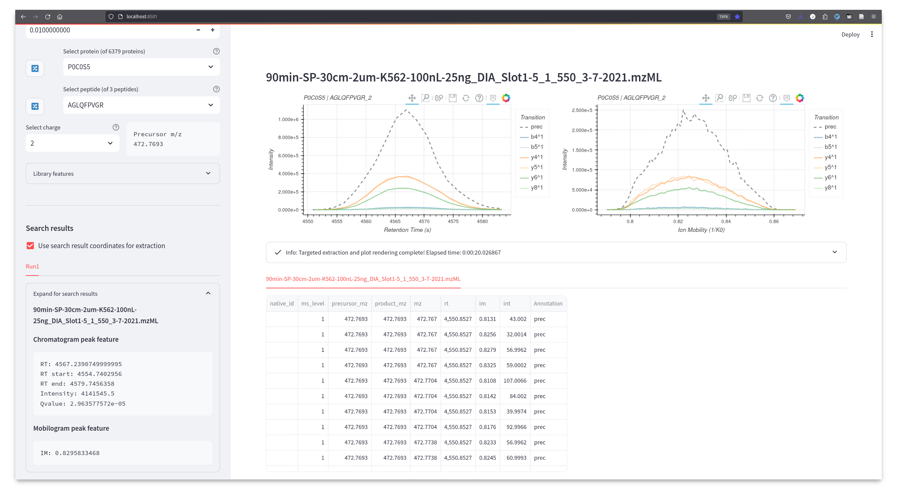
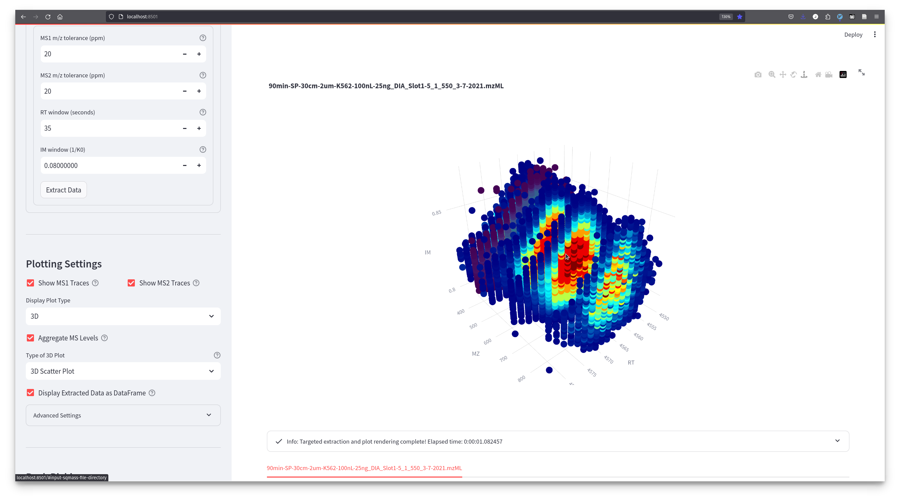

On-The-Fly Targeted Extraction of Raw DIA Mass Spectrometry Data Workflow
=========================================================================

Once you select the Raw Mass Spectrometry Data tab, you will see the workflow depicted in :numref:`RawExtractionInput` illustrating the input components for the Raw Targeted Data Extraction process. These inputs include: i) the file path of the transition list containing analyte information, ii) the file or directory path containing raw Data-Independent Acquisition (DIA) mass spectrometry data, iii) the file path for search result files containing feature identification results, and iv) a dropdown selection to specify the software from which the search results were derived. These elements collectively form the essential parameters for executing targeted data extraction, providing a comprehensive view of the key inputs guiding the workflow.

.. _RawExtractionInput:

   Peak-Picking Dropdown List Options. The peak-picking dropdown selection allows the user to select different peak-picking algorithms to display peak boundaries on the chromatogram figure.

In :numref:`diaPASEFTargetedExtraction`, a practical illustration of targeted extraction for diaPASEF data is presented. The sidebar panel showcases controls for selecting analytes from the transition list, a dropdown text area with search result details derived from DIA-NN for the chosen precursor. The main panel provides visualizations of the extraction ion chromatogram and the extracted ion mobilogram, utilizing identified retention time and ion mobility coordinates from DIA-NN. The accompanying table below the plots contains raw extracted data, offering the option to save the information as a CSV file for subsequent analysis and manipulation. The extraction parameters in the sidebar allows the user to adjust the mass-to-charge tolerance (ppm) window, the retention time window and the ion mobility window settings for optimizing the extraction (:numref:`multidimensionalPlots`).

.. _diaPASEFTargetedExtraction:

   Sidebar panel demonstrates transition list controls for analytes selection, and search results information obtained from DIA-NN for the selected precursor. The main panel displays the extraction ion chromatogram and the extracted ion mobilogram for the current precursor based on identified retention time and ion mobility coordinates from DIA-NN. The table below the plots is the raw extracted data which can be saved to a csv file for further manipulation.

The benefit of extracting from the raw data is the direct access to the full extracted data for a selected analyte. This allows the user to plot different kinds of plots and different dimensions of plots, one dimension plots, two dimension plots and three dimension plots :numref:`multidimensionalPlots`. For one dimensional plots, the user can visualize the extracted spectra, chromatogram and mobilogram. Peak-picking can also be applied as in the first workflow, specifically for the extracted ion chromatograms. Two dimensional plots allow heatmap style visualizations of two dimensions, i.e. retention time vs ion mobility.  Three dimensional plots allow you to visualize spectrum-chromatogram plots, scatter heatmap plots of mass-to-charge (:numref:`multidimensionalPlots`), retention time and ion mobility, and three dimensional contour plots of two dimensions. 

.. _multidimensionalPlots:

   The dropdown extraction parameters allows for optimizing the extraction windows for mass-to-charge, retention time and ion mobility. The plot settings in the sidebar panel allows for selecting between different types of plots, one dimension plots, two dimension plots and three dimension plots.

