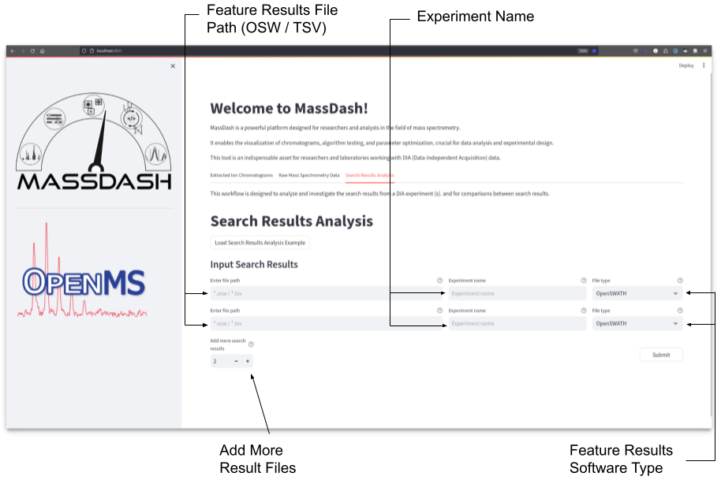
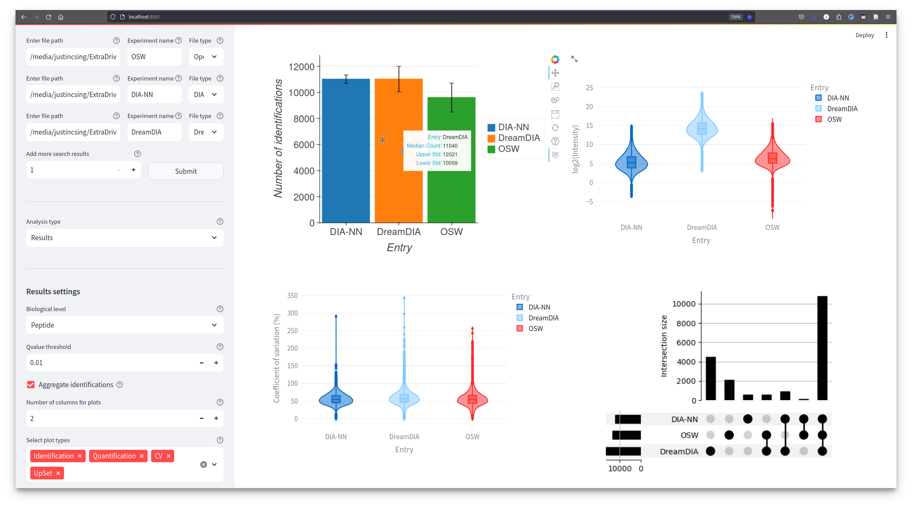
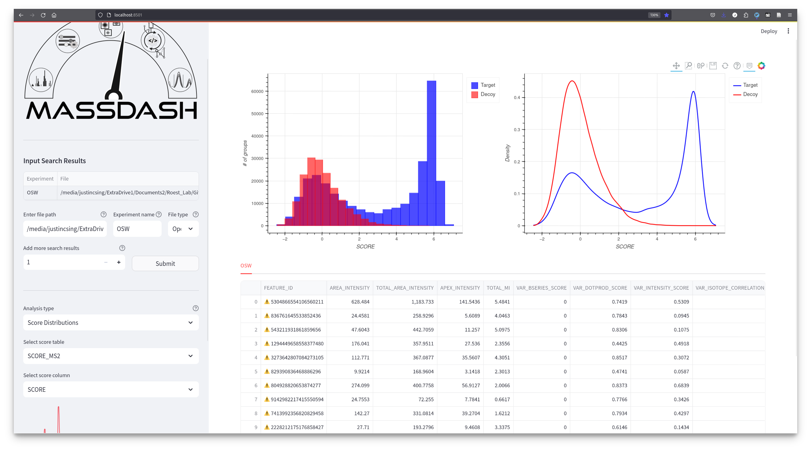

Search Results Comparisons Workflow
===================================

Once the Search Results Analysis tab is selected, you will see two text input widget fields, and a dropdown selection bow (:numref:`SearchResultsAnalysisInput`). The text input fields are for the search results file path, a label to name the experiment for the search results, and the dropdown selection box is used to determine what software generated the search results. Additional search results can be added by toggling the numeric input widget to add additional entries. There are two different types of analysis workflows currently supported, a results workflow and a score distributions workflow, which is selected in the dropdown box in the sidebar. The default workflow is set to the results workflow.

.. _SearchResultsAnalysisInput:

   The welcome page for the search results analysis tab required a feature results file path, an experiment label, and the type of software from the dropdown that generated the results. Additional search results can be added from the numeric input toggle button.

In (:numref:`SearchResultsAnalysis`), the analysis of search results comparisons is depicted, highlighting the versatility of MassDash. The sidebar provides settings to control results at a specified Q-value cutoff, enabling the generation of informative visualizations. These include an identifications bar plot, a log2 quantifications violin plot, a coefficient of variation violin plot, and an upset comparisons plot. This figure underscores MassDash's capability to facilitate comprehensive and customizable comparisons at the biological level, empowering researchers in their data interpretation and analysis. The analysis of score distributions provides users with a visual representation of the distributions of targets and decoys across various scoring levels and score variables. The main panel displays Bokeh plots illustrating the score distributions, accompanied by a table presenting the corresponding feature scores and variables (:numref:`SearchResultsScoreDistributions`)

.. _SearchResultsAnalysis:

   Sidebar results settings allow for control on the biological level at a specific Qvalue cutoff to generate an identifications bar plot, a log2 quantifications violin plot, a coefficient of variation violin plot, and an upset comparisons plot.

.. _SearchResultsScoreDistributions:

   The score distributions analysis allows the user to visualize the distributions of targets vs decoys for different scoring levels and different score variables. The main area displays bokeh plots of the distribution of scores and a table of the feature scores.

