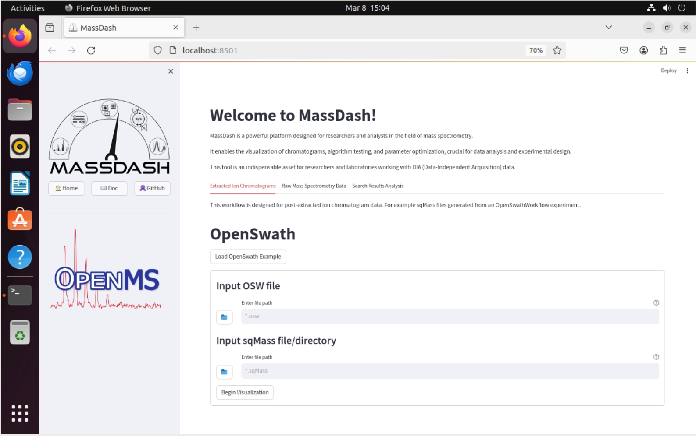

MassDash Installation on Ubuntu 22.04
======================================

This guide will help you install MassDash on Ubuntu 22.04.

.. note::
    This tutorial was created using a clean installation of Ubuntu 22.04 using a virtual machine. The virtual machine was created using Oracle VM VirtualBox, with 64Gb of RAM, 8 processors, and 64Gb of storage. The virtual machine was created using the Ubuntu 22.04 iso file from `Ubuntu <https://ubuntu.com/download/desktop/thank-you?version=22.04.4&architecture=amd64>`_.

Prerequisites
-------------

It is recommended to use Anaconda to manage Python environments and packages. You can download Anaconda from `here <https://www.anaconda.com/download>`_. You can find documentation for installing Anaconda on Ubuntu `here <https://docs.anaconda.com/free/anaconda/install/linux/>`_.

Installation
------------

1. Launch a terminal and create a new conda environment using the following command:

   .. code-block:: bash

      conda create -n massdash python=3.9 -y

2. Activate the new conda environment using the following command:

    .. code-block:: bash
    
        conda activate massdash

3. Install massdash using the following command:

    .. code-block:: bash

        pip install massdash

Usage
-----

Help
~~~~

You can get help on how to use MassDash's GUI by running the following command in the terminal:

.. code-block:: bash

    massdash gui --help

Launch MassDash GUI
~~~~~~~~~~~~~~~~~~~

You can launch MassDash's GUI by running the following command in the terminal:

.. code-block:: bash

    massdash gui

A browser window will open with the MassDash GUI. If the browser window does not open, you can navigate to the following URL in your browser using the local url provided in the Anaconda CMD.exe output, by default it should be `http://localhost:8501/`, unless the port is changed.

**Note:** MassDash warns you that onnxruntime, torch, and torchmeets are not installed. You can ignore this warning if you do not plan to use the MassDash's peak picking conformer model. 

Once the browser window opens, you can start using MassDash's GUI to visualize your mass spectrometry data. For more information on the GUI, please refer to the `MassDash GUI Documentation <../GUI.rst>`_.

