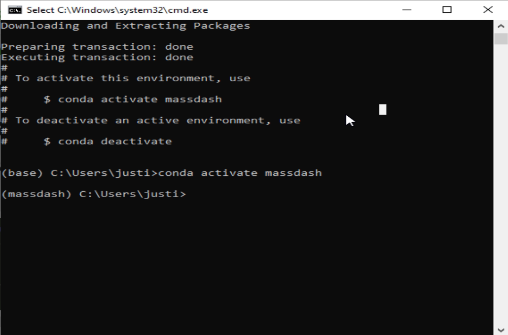

# MassDash Installation on Windows 10

This guide will walk you through the installation of MassDash on a Windows 10 machine.

# Prerequisites

It is recommended to use Anaconda to manage Python environments and packages. You can download Anaconda from [here](https://www.anaconda.com/download). You can find documentation for installing Anaconda on windows [here](https://docs.anaconda.com/free/anaconda/install/windows/).

# Installation

1. Launch the Anaconda Navigator from the start menu.

2. Launch the Anaconda CMD.exe Prompt from the Anaconda Navigator.


3. Create a new environment by running the following command in the Anaconda CMD.exe Prompt:

```bash
conda create -n massdash python=3.9 -y
```


4. Activate the new environment by running the following command in the Anaconda CMD.exe Prompt:

```bash
conda activate massdash
```



5. Install MassDash by running the following command in the Anaconda CMD.exe Prompt:

```bash
pip install massdash
```


# Usage

## Help

You can get help on how to use MassDash's GUI by running the following command in the Anaconda CMD.exe Prompt:

```bash
massdash gui --help
```

    

## Launch MassDash GUI

You can launch MassDash's GUI by running the following command in the Anaconda CMD.exe Prompt:

```bash
massdash gui
```

A browser window will open with the MassDash GUI. If the browser window does not open, you can navigate to the following URL in your browser using the local url provided in the Anaconda CMD.exe output, by default it should be `http://localhost:8501/`, unless the port is changed.

**Note:** MassDash warns you that onnxruntime, torch, and torchmeets are not installed. You can ignore this warning if you do not plan to use the MassDash's peak picking conformer model. 

