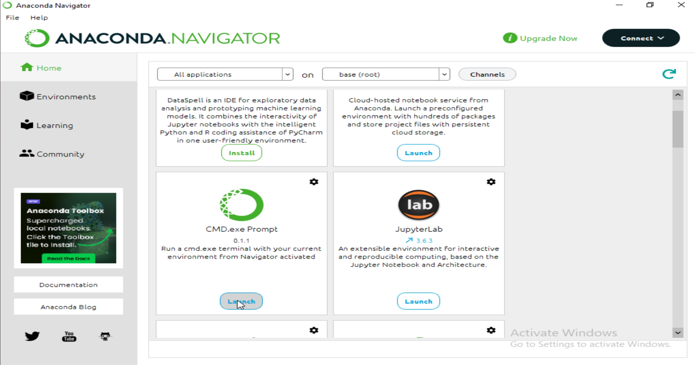
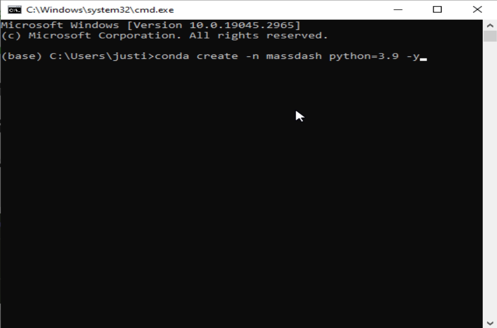
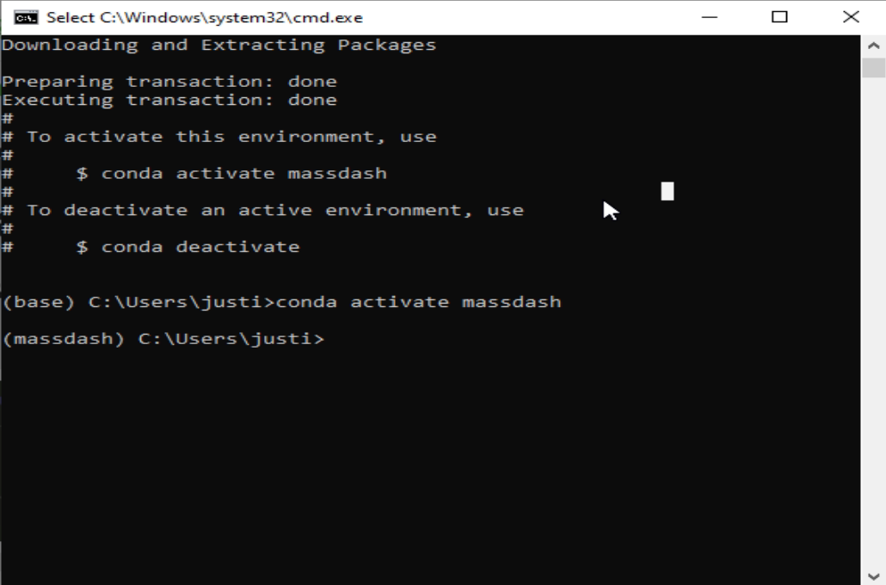
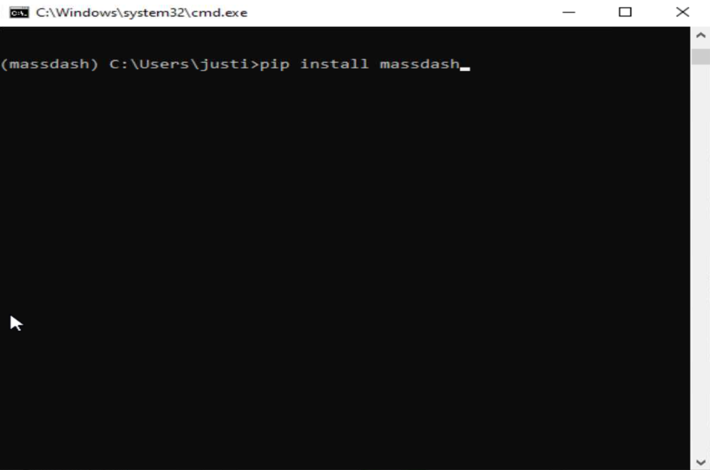
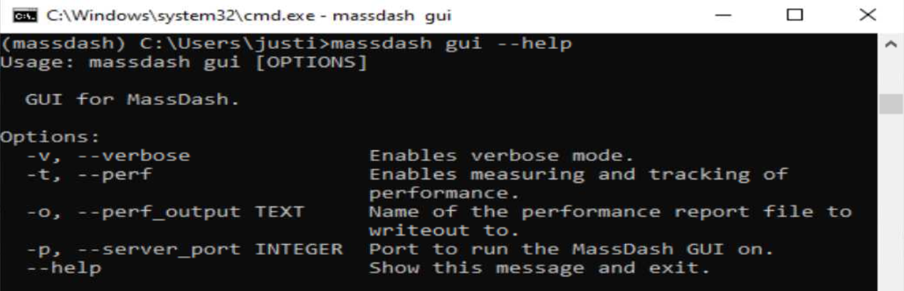
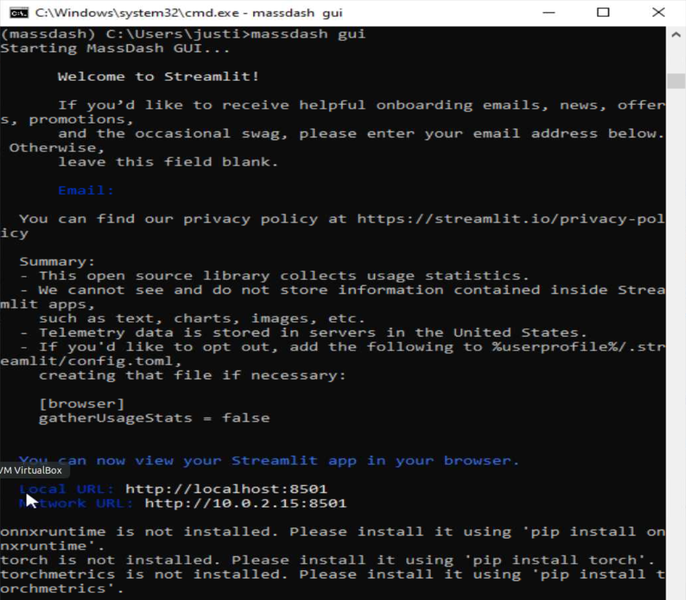
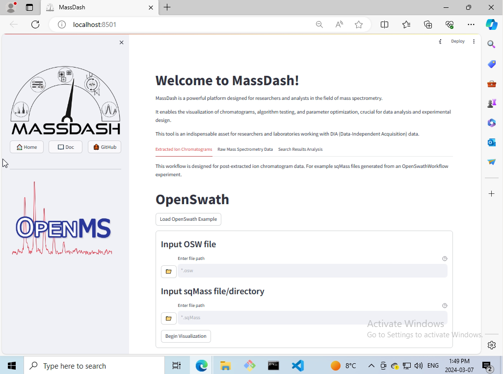
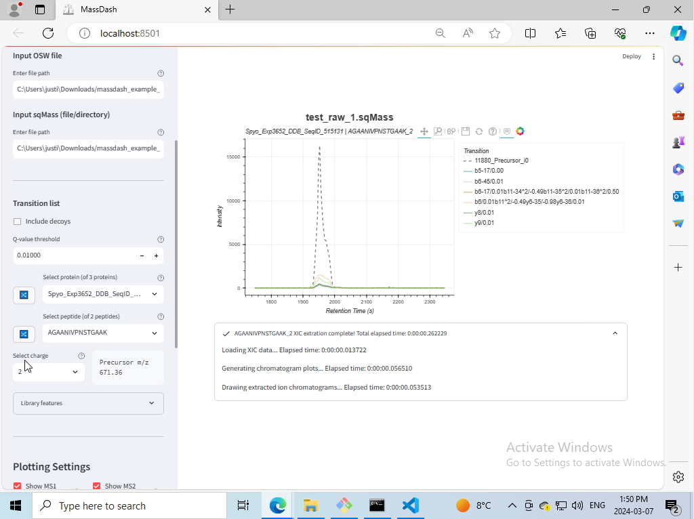

MassDash Installation on Windows 10
====================================

This guide will walk you through the installation of MassDash on a Windows 10 machine.

.. note::
    This tutorial was created using a clean installation of Windows 10 using a virtual machine. The virtual machine was created using Oracle VM VirtualBox, with 50Gb of RAM, 8 processors, and 50Gb of storage. The virtual machine was created using the Windows 10 ISO file from `Microsoft <https://www.microsoft.com/en-us/software-download/windows10>`_.

Prerequisites
-------------

It is recommended to use Anaconda to manage Python environments and packages. You can download Anaconda from `here <https://www.anaconda.com/download>`_. You can find documentation for installing Anaconda on windows `here <https://docs.anaconda.com/free/anaconda/install/windows/>`__.

Installation
------------

1. Launch the Anaconda Navigator from the start menu.

2. Launch the Anaconda CMD.exe Prompt from the Anaconda Navigator.

3. Create a new environment by running the following command in the Anaconda CMD.exe Prompt:

.. code-block:: bash

    conda create -n massdash python=3.9 -y

4. Activate the new environment by running the following command in the Anaconda CMD.exe Prompt:

.. code-block:: bash

    conda activate massdash

5. Install MassDash by running the following command in the Anaconda CMD.exe Prompt:

.. code-block:: bash

    pip install massdash

Usage
-----

Help
~~~~

You can get help on how to use MassDash's GUI by running the following command in the Anaconda CMD.exe Prompt:

.. code-block:: bash

    massdash gui --help

Launch MassDash GUI
~~~~~~~~~~~~~~~~~~~

You can launch MassDash's GUI by running the following command in the Anaconda CMD.exe Prompt:

.. code-block:: bash

    massdash gui

A browser window will open with the MassDash GUI. If the browser window does not open, you can navigate to the following URL in your browser using the local url provided in the Anaconda CMD.exe output, by default it should be `http://localhost:8501/`, unless the port is changed.

.. note::
    MassDash warns you that onnxruntime, torch, and torchmeets are not installed. You can ignore this warning if you do not plan to use the MassDash's peak picking conformer model. 

Once the browser window opens, you can start using MassDash's GUI to visualize your mass spectrometry data. For more information on the GUI, please refer to the `MassDash GUI Documentation <../GUI.rst>`_.

